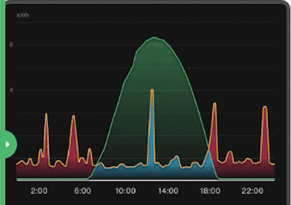

# Homsai Engine: maximum comfort, minimum consumption thanks to AI

**Homsai Engine** uses artificial intelligence to optimize the consumption of your home and save energy.
Thanks to our add-on you will no longer have to think about managing the devices in the house because it will be the Homsai Engine **that will make the photovoltaic system and the HVAC devices work in synergy**, guaranteeing savings and maximum comfort.
  

  

  

## Why choose Homsai Engine

- **Minimum effort, maximum result**: with Homsai Engine you will take advantage of a sophisticated algorithm that will allow you to spend nothing on energy, without the need to call an installer.
- Automatic detection of **all devices** on your instance
- Reporting with **detailed consumption** of HVAC devices
- **Simple** and well documented installation
  Add the add-on and proceed with the initial wizard: in a few minutes you can make your home really smart. With lower bills and maximum comfort for you and your family.

## Resources

- [GitHub](https://github.com/HOMSAI-Smart-Home/HOMSAI-Add-on)
- [Website](www.homsai.app)
- [Instagram](https://www.instagram.com/homsai.app/)
- [Facebook](https://www.facebook.com/HomsaiApp)
- [Contact Support](mailto:hello@homsai.app)
